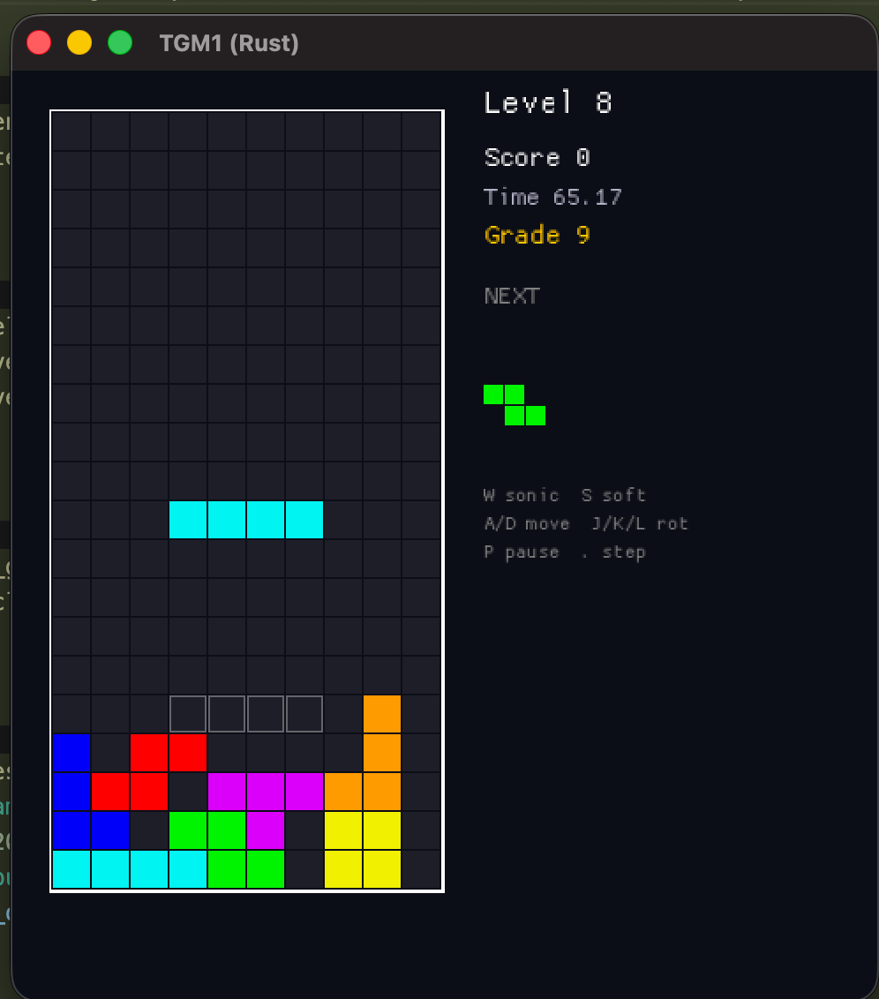

# A vibe coded TGM1-ish game.

> Disclaimer: This codebase 100% vibe coded AI output.
> Do not ever use this as a reference for anything, as it is
> plausibly correct, but subtly, and importantly, incorrect.
>
> NONE OF THE README TEXT HERE WAS WRITTEN BY AN AI, NOR WAS IT
> AI ASSISTED IN ANY SHAPE OR FORM. I DO NOT BELIEVE IN AI WRITING.

**Downloads are in the sidebar. Enjoy.**

# Video

This is a sped up showcase video of autoplay, not me.

<video src=".img/showcase.mp4" controls autoplay loop style="width:100%;max-width:540px;display:block;margin:24px 0;border-radius:12px;box-shadow:0 2px 8px #0003;"></video>

# Total Cost

- About 4 hours of my time
- I went from 20% of my Cursor usage to 21%. I didn't even move the fucking needle.
- Built entirely with Composer 2 (Fast).

# And top-of-head thoughts

I can't believe any of this is possible. The whole time I would give it tasks I thought it would fail on,
and it only really definitively failed on three things (positioning hud elements, an autoplay engine, and making good music).

**Here is the tersest summary I can give.** If you are in a **VERIFIABLE** domain, you should try solving it with current state-of-the-art models. These tools can produce at such a rate that you'd be remiss to not use them.

That means, if you can, **make your domain VERIFIABLE**. That means getting test infrastructure set up, and
giving the LLM a feedback loop so it can verify its changes. Ditto for performance improvements, write a
benchmark, and have it use that to guide itself.

Lots of very valuable things are verifiable domains, or can be approximated with one - things like software
performance and certain behaviours. These are all now extremely cheap to make.

For less verifiable domains (do I have good observability and debugging, does this animation look good), **YOU**, the human, become the verifier. **You are the tastemaker, and your taste is critically important.**

Difficult things are still difficult - the LLM was not smart enough to write an Autoplay engine that can complete the game, let alone get the best rank.
It wasn't able to understand writings it found online about pyramid stacking, and usually just killed itself.

**Lots of things are cheap now that would've been prohibitively time expensive now.**
You can spin ffmpeg around with plaintext, you can drive lldb. You can add grafana observability to your stack, you can benchmark every endpoint you have. You can find security vulnerabilities in your C codebase.

You can ask for solutions for things that have annoyed you for years, and, **if the domain is verifiable** you can **DISCARD THE BROKEN OUTPUT** and keep only the good stuff. That is the only critical lesson I have.

# About

When I was learning rust back in 2023, I wrote [rgm](https://github.com/zkldi/rgm) to get to grips with the language.

Nowadays, you can build shit software in a fraction of the time, and without ever needing to learn anything,
so here's my re-hizzle on the problem.

I had nearly £200 worth of cursor credits left over at the end of the month, and I fancied playing some TGM1 on my macbook.

I reckoned it would be faster, and more fun, to vibe code an almost-tgm1 that runs on my macbook, rather than learn how to set up MAME and go and steal the game.

**This was done for fun. Don't take it seriously.**

The initial prompt was, and I'm not joking:

> You are on full autopilot, and I am using the last of the credits I have for the month.
>
> Build a copy of Tetris: The Grandmaster 1. Use whatever technologies you want that will be very debuggable (think about what will help you)
>
> The features I want are complete compatibility:
>
> - I should be able to start the game and get to level 999
> - Scoring and grading should be the same
> - The gravity curve should be the same
> - Controls should be WASD (up down left right) with JKL as rotations.

I thought this would take a while, but it actually took about 4 minutes, and cost **less than one penny**.

Here's the first thing I saw when I booted the game:



And it was decently playable then, but had all sorts of bugs with rotations (this is surprising, I would've thought it would've got this correct as it was just copying the tetris wiki).

## Bits I'm proud of

I repeatedly asked the LLM to juice the game up - to animate things, make them pop, use shaders and all that.

I think it's done a brilliant job of making the game feel like a game, the animations do really sell it.

I am **utterly gobsmacked** at the quality of the BG Animations. I asked it to make some, and it made one that was just OK (the cogwheels one).

I asked it to make 9 more and just pasted in some images - I pasted in a PCB and DNA and some sort of biological tissue thing. I mean, maybe you shouldn't be surprised, right - this is effectively a domain translation machine - but I am _in awe_ of the fact that it is smart enough to translate images into rust code that generates arcade-style BGA loops.

You can see all of these in Settings > BG Test.

## Arcade accurate?

No. Not even close. I think some of the rotations are wrong, and I haven't seriously checked the scoring or the grading.

## Readable code?

Absolutely not. Reading this code feels like reading the output of a transpiler - which I guess it technically is. Since the robot doesn't need to give much of a fuck about human things like "readability", it is mostly a soup of random unexplained floats and integers.

## Bugs?

### Autoplay is just complete dogshit and _really_ computationally heavy

LLMs presently just don't have the reasoning ability to write a good TGM1 autoplay, it requires knowledge of navigating 20g, and knowing how to with-hold clearing lines until you get a tetris.

**A competent human could easily write an autoplay that outclasses this.**

I tried it with Opus 4.6 and left it running for nearly half an hour (again, I have tokens to burn as they're resetting) and it just got nowhere, sadly.

### I think one of the J rotations is wrong. I think.

Haven't actually checked, but it feels wrong. I swear I've made some rotations in this game
that don't make any sense.

### There's no music.

The music is one of the best parts in TGM, and AI uh, can't make music. It gave it a really good effort, but I've stripped it out of the final build as it was just too funny.

### It just can't do HUD positioning and alignment very well

Like, at all. Now, to be fair, I'd do a shit job too if I had to build UI like this. It effectively just throws integer offsets at the problem,
but most importantly - it has no way of _seeing_ what its done, it just has to "visualise" it.

Because it has no feedback loop, it really, really struggles to get it right, especially when making adjustments.

You might notice some random text on the screen - like the bit that says "NORMAL" etc.
I haven't bothered to ask it to position it right, and I think it would really struggle.

## Who owns this code?

I don't know. I mean, it's clean room - it's never seen any of the TGM binaries or assets or anything like that - It's recreated the game off of a conversation and wikis its found online.

# Full conversation

Have a good laugh at this. I haven't annotated or corrected any of it.

This is **THE ONLY THING** I did to implement this repo.
Everything was generated by the LLM, and I have only looked at the code, not edited it.

```
---

You are on full autopilot, and I am using the last of the credits I have for the month.

Build a copy of Tetris: The Grandmaster 1. Use whatever technologies you want that will be very debuggable (think about what will help you)

The features I want are complete compatibility:
- I should be able to start the game and get to level 999
- Scoring and grading should be the same
- The gravity curve should be the same
- Controls should be WASD (up down left right) with JKL as rotations.

---

Rotations don't work very well - holding the key down causes rapid instant spam of rotations. Also, I don't believe I can rotate the S piece, for some reasons

---

Rotations on the L piece are all kinds of fucked up. Write a full test suite for *all* rotations and prove they are correct exhaustively

---

Rotating an I piece at the very start of the game seems to kill you instantly

---

DAS feels very fast, too fast, even

---

But is this in line with what tgm1 does? what does tgm1 do, exactly

---

Do exactly what tgm1 does

---

Animate and change the alpha or colour slightly of the "Active piece" so that it's clear when it's in lock delay vs when its placed

---

also just dim every piece on the stack

---

The DIM is too much - it should be just marginally more dim

---

One of the T piece rotations is wrong, it moves the center to the left a bit. it should move around like a plus, in sega rotations

---

Does the game actually run at 60fps? Everything feels far too fast

---

Well. cap the game at 60fps

---

I think this has completely fucked up input handling

---

Keypresses just don't seem to register properly anymore

---

I have to hit rotate many times for it to rotate

---

You can't rotate a piece while moving it sideways, and you should be able to

---

undo this

---

Down doesn't seem to insta lock pieces, but it should - if they are lockable. A common move in tgm is to do up then down to hard drop

---

Instant-DAS is missing from the game as a mechanic, but should exist. I believe. Fact check me before you implement this, but the game seems impossible without instant das

---

It's a mechanic like IRS

---

Alright. We're reimplementing TGM1 exactly as is. The game is playable, but we're missing the main menu. Go look at how the real game's main menu is done and mirror that - remember that it is an arcade game

---

Change the title code inputs to be WASD (up down left right) and JKL (A B C). Add some visual feedback onto the screen when you press the keys

---

I just can't seem to be able to input title codes at all

---

Indicate on the title screen - like in tgm1 - what modifiers are turned on.

---

Create a replay format, the ability to browse and watch replays and also the high scores for the machine - do the high scores in a json file next to the game - if one doesn't exist, make it

---

@crates/tgm_core/src/board.rs:64-71 This function panics if you're in 20g and die

---

Every game uses the same random seed. This is wrong - make sure to update replays to store the seed, too

---

The game occurs in a very small window at the moment - it shouldn't. I understand the original tgm1 was 800x600 or something, but I should be able to pick resolutions and all that like in a modern game.

---

The game occurs in a very small window at the moment - it shouldn't. I understand the original tgm1 was 800x600 or something, but I should be able to pick resolutions and all that like in a modern game.

---

Game is upside down now

---

OK. The game is mostly compatible but EXTREMELY ugly. There's none of the fancy art direction or style from tgm. I think tgm2 is a very pretty game, so look up how that game does its aesthetics and implement it.

---

Nah, keep the game as TGM1. No need to say TGM2 everywhere (it's mechanically not)

---

change the style to tgm1

---

Enter doesn't take you back to the main menu because there's no keypress/keyheld distinction - it triggers as two rapid enters and takes you back to the game

---

Rotating a piece shouldn't reset lock delay. this is a bug

---

The game is missing animations in loads of places. lines breaking, no death animations, no lock animation for pieces. It's also missing animated backgrounds, which are a very pretty part of tgm. Add all of this. Keep in mind the aesthetics of the game are like this

---

One of the other things tgm does is that when you go over a level transition at 100, the background changes. At the moment we only have one background. Make 9, plus one for the main menu and one for the replays screen.

---

These are just colour changes... Add 9 genuine new backgrounds.

---

The game doesn't appear to render anymore on the main menu

---

Just apperas to use all system resources and hang

---

When you die, the piece that killed you should still render on the screen, at the moment you can't tell how you died

---

You shouldn't be able to IRS into death - this is most obvious with the I piece

---

Replays should just always save. no point prompting the user

---

Remove credits from the game and just make enter start the game. remove the TITLE CODE: WASD bit too

---

Make pause and step only part of replay mode, get rid of it in gameplay. Also add scrubbing of frames to replay mode

---

Scrubbing is way too fine. I'd honestly like to be able to click and drag on a bar - a bar that has little timeline events for events (like 100, 200, 300, etc.)

---

Clicking and dragging on replays doesn't seem to work

---

The ghost hint from levels 0-100 is not visible enough

---

Alignment of almost all the HUD is just not very good. Also the HUD is very unstyled. I feel like things should have borders, and that parts of the UI should animate a bit like the dashboard of an aesthetically appropriate "mech". Like, sonic dropping, moving left/right, and the gravity at the moment should subtly impact and animate bits of the ui.

---

The L piece (dark blue) spawns too low at the start of the game, for some reason

---

@/Users/zk/.cursor/projects/Users-zk-Documents-Repos-inst/terminals/1.txt:371-380 Trying to enter a replay does this

---

Text is still too high inside the hud elements

---

Why does the game take so long to boot?

---

Add an animation test screen so i can see all the bg anims

---

The grade is too high inside the HUD, and not centered like the next piece

---

Still too high, move even lower

---

It should be centered in the hud box it's in

---

The hud moving down between levels 300 and 400 is very very disorienting and shouldn't happen. I don't know what causes it but some visual effect

---

I actually like the hud reacting to up/dwn motions on the stick, it just shouldn't react so harshly between 300 and 400

---

The speed of the background animation should gradually lerp towards 2.0x speed, the closer the player is to the top of the screen.

---

The "truss" background is strange and doesn't appear to loop

---

Exclude the currently being-played mino from the background animation speed multiplier. Also increase it to 3.0x at the top

---

like, it should lerp from 1.0x to 3.0x.

---

This seems to "jolt" the animation whenever a piece is placed (or whenever the height of the stack changes, rather. The speed increase needs to be from the previous animation frame, onwards. - just changing the multiplier jolts you a bunch forward in time

---

Add some sort of clickable slider to the bg view so i can test this out

---

The game over screen is very ugly and not animated. Style it up and add some animations. The "GAME OVER - ENTER TITLE" all on one line is awful, too

---

"enter title" just sounds like you need to put your name in - which you don't. It should say "Press enter to leave or something"

---

There are no screen transition animations at the moment. Lets add them.

---

The hud should react in some way to the rotational button presses (JKL) - in a subtle way that keeps with the cockpit theme, where the HUD reacts to what you do but not in an obvious way; it feels responsive even if users can't articulate why.

Similarly, the hud should do _something_ when the player is in a wait state - i.e. level trapped at 199 and needs to clear a line. These indications should be animated and juicy, but not distracting and not obvious.

---

Lets start centering the hud. The timer should be below the playfield, and the next piece above it. Here is a picture of tgm1

---

Yeah I want the playfield centered and the rest of it. continue!

---

Text is consistently misaligned

---

The next piece is rendering underneath the playfield, not above it.

The timer is rendering ontop of the playfield, and is maybe 64px too high

---

The next piece is ontop of the playfield . It is not inside of the box it should be. move it significantly up

---

Now that the hud is centered, the hud moving around in reaction to stick movements feels very bad. Keep the hud static.

Decrease the vertical size of the "NEXT" box so there is a gap between it and the playfield

---

Now, in keeping with the cockpit vibes, I would still like some stick motion indications - maybe not shifting the hud around, but have a think about it. WHat can we add to the screen that can maybe move around or at least "feel" like its reacting to hte players motions? even if it's just fluff like fake airbreaks/engines/gears/gundam stuff.

---

Now that the hud is centered, the hud moving around in reaction to stick movements feels very bad. Keep the hud static.

Decrease the vertical size of the "NEXT" box so there is a gap between it and the playfield

---

Ok I like this a bit but it's not very visible. Make it more tall, maybe like a sort of radial - it would look like a left parentheses against the flat line of the | playfield wall. Up and down don't appear to cause any reaction either, but they should.

---

It

---

It's nice but not juicy or animated enough. it doesn't *feel* juiced up.

---

I think the lines should be thicker and less alpha - like smoke particles or a sort of wuwuwuwuwuwu kind of feel, like a ray gun or alien abduction.

---

OK I see the vision. Make the L-R tractor beams the same height as the left and right walls of the playfield, and on the same positions. Make them subtler.  Make the "Up" indicator at the top horizontal line of the playfield, and the down indicator at the bottom.

---

Make the bottom and top ones the same width as their respective playfield sides. Also, everything is too subtle now, crank it back up

---

In draw order, these animations should go ontop of the next box - at the moment the up one is covered by that

---

When you release a key the tractor beams snap back to 0. instead, make them decay back very fast - but not instantly

---

Alright sadly shelve all this code. It just doesn't look good. Sorry

---

Remove "hud motion". Have the corresponding walls (up down left right) of the playfield animate a little and move subtly in response to the stick movements

---

It's too subtle - it should animate a bit more (maybe play with the colour) and affect the movement a bit more. Also, the movement is inverted. When i move right, the right wall should move right, and so on.

---

Ok. Make up and down instead move the hud, like literally jolt the hud up and down instantly with no decay. Make left and right just animate the colour and not change the size or position of the thing.

---

Decrease the hud nudge by a factor of

---

2

---

Add an animation when you go up a grade

---

Improve the replay menu - format play timestamps instead of just using unix seconds or whatever. also show [GRADE] and [LEVEL] and [SCORE] in each replay row. Give thought to the formatting.

---

Replays should unpause when you Release on the seek bar

---

The "Truss" background is too distracting. Tone it down

---

All the backgrounds are a bit dim, can we increase the brightness? is there some sort of dimmer over them?

---

Change the main menu to be a selectable series of things - the following options should exist:

- Normal
- Autoplay
- High Scores
- Replays
- Exit

---

continue

---

Ah and hide the "mode" indicators, they're secret now

---

Implement the "autoplay" mode properly - it should make perfect decisions and not die.

---

In "autoplay" mode, decrease the lock delay to 1 frame.

---

Sorry not lock delay - line clear and next piece delay.

---

The autoplay is very very laggy - it does a ton of computation. There has to be an efficient way of doing this! IT doesn't even go for tetrises!

---

TGM1 doesn't have a "background" grid of gray minos. instead it just has a darker dimming. Implement that

---

Doesn't need to be pitch black - just dim

---

I still can't see the background thruogh the dimmer

---

Remove the instructions from the gameplay HUD

---

Add some fancy shaders to really juice up the game.

---

The CRT bend is toooo strong - and it's not very animated. It looks nice, but cheap because it's so static...

---

No the wobbling is worse. Lets tone all of this way, way, way down

---

It's pretty, but it just is too much for the "whole" game. Lets think about shaders for juicing up *in response to* events in the game

---

Add a sonic drop animation - The piece should instantly jump down, but some animation should occur showing it slam down, maybe

---

speed this animation up like, 10x, and put a shader on it to give it some blur

---

Something is wrong with the shader - it seems to show more than just the active piece moving - it should only be the active piece

---

Lock delay should only reset when the active piece _goes down a row_. at the moment, players can spam rotate to never have a piece lock!

---

Still doesn't work - holding up (sonic drop) keeps the piece active

---

The flash on fall animation is too much especially around the 300 400 mark

---

Add a settings screen and move the resolution stuff there + BG test

---

The seekbar on the replay doesn't align with the cursor

---

Game is missing sound effects and music. The original TGM had a soundtrack from sampling masters with some great music. You will need sound effects across the board, and then two bgms - one for 0-500, and one for 500 onwards.

---

Remove the rotation sound effects. Add a unique sound effect for each piece - this is the "next piece audio indicator". Tgm1 has this.

---

remove the left/right mvoement sounds too. Make the tetris sound happier. Make the I piece indicator the highest pitched one, and teh O the lowest pitch

---

Your sfx playing is off by one - it should be the "next" piece that gets the sound played - NOT the one that is currently played

---

Add a sound queue like a "last call", 3 rings of a bell, when the player is at the level cap i.e. 199 and needs to clear a line to continue

---

Lets start stylising the gameplay timer. When the level transition happens it should indicate to the player the time they passed the section at. We can visually (but not mechanically) keep the timer on a certain number and have it increase size and flash, maybe. Apply some fancy shaders. *really* juice it.

---

Decrease the time between the three beeps in the level indicator, and increase the pitch

---

make the file again, use an actual chord sound. it sound sound like ding ding ding with very little spacing - whole thing should be about 0.6 secs long - high pitched dings

---

Add a sound fx test menu to the settings page, next to bg test

---

Hitting esc should take you out of the game

---

Make all of the line clear sounds chords - the 4x clear one is very nice - don't change.

---

This doesn't work. Regenerate the files and think about an ascending list of 3 chords

---

Remove all the title screen cheat codes and all of their settings.

---

Add a splash screen for the game - when it boots. Very pretty animations that showcase the game and demo it; an attract loop, in arcade terms.

---

In demo mode - although you're using autoplay, slow the autoplay down and make it use normal clear delay rules

---

OK don't slow it down - just set the line delay to normal

---

Lets juice the score counter. When you make some points it should animate. Use animations and shaders. The excitement in the animation should correlate with the amount of points gained

---

The full screen flashes are too much, just juice the score indicator

---

We re-use a background animation for 800-900 and 900-999. Make 800-900 use a new background animation. Here is some inspiration

---

This hangs the game when i observe it

---

Not enough motion in the background Combine it with something like this

---

Now lets improve the title screen one - here's some inspiration.

---

Nah. ignore the floor. Focus more on the orange and the windows. Give it some sort of technological edge. These are abstract queries, use your taste.

---

Ok remove the windows, the rest is great. thanks

---

Add sound effects to menu movements - move, accept, go back, etc.

---

Make the game complete animation _way_ prettier. Juice it up! Really applaud the player and show their score/grade/time front and center.

---

The music for the game is stubbed out. Get me some drum and bass and put it in. the second bgm should be more intense.

---

Can you make the music instead?

---

There's no melody, and the loop is way too short.

---

Ok great effort. revert everything to what it was before. sorry

---

@/Users/zk/.cursor/projects/Users-zk-Documents-Repos-inst/terminals/1.txt:974-983 I got a tetris and the game crashed!

---

Scan this whole codebase for bugs and vulnerabilities

---

Write me a script that dumps every single prompt I wrote for this repo to a text file for other humans to read.

---

Can the prompts be sorted by time?


Total user prompts: 188
```
